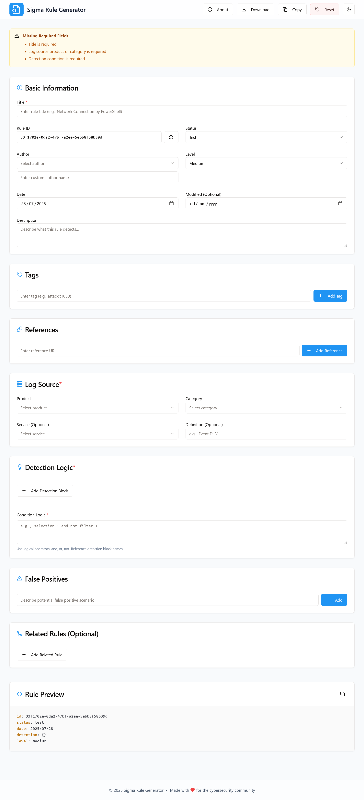
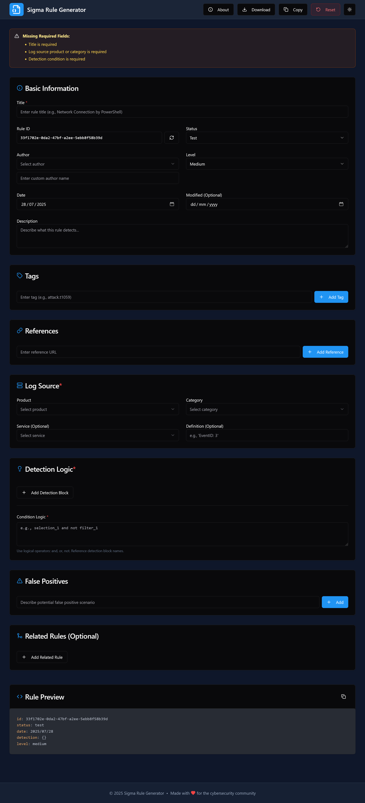

# Sigma Rule Generator

A user-friendly, open-source web application for creating Sigma rules to enhance cybersecurity detection. This tool provides an intuitive interface for generating Sigma rules with a live YAML preview, making it easy to craft detection rules without deep technical knowledge.

## Features

- **Simple Form Interface**: Easily input Sigma rule details through a structured form.
- **Live YAML Preview**: See your rule in YAML format as you type.
- **Validation**: Ensures rules are correctly formatted and valid.
- **Export Options**: Download your Sigma rule as a YAML file or copy it to your clipboard.
- **Responsive Design**: Works seamlessly on desktop and mobile devices.
- **Dark/Light Theme**: Switch between themes for a comfortable user experience.

## Getting Started

### Prerequisites
- Docker (for containerized deployment)
- Node.js and npm (for local development and production)
- A modern web browser (e.g., Chrome, Firefox, Edge)

### Installation for Development

To run the project locally for development:

1. **Clone the Repository**:
   ```bash
   git clone https://github.com/your-username/sigma-rule-generator.git
   cd sigma-rule-generator
   ```

2. **Install Dependencies**:
   ```bash
   npm install
   ```

3. **Start the Development Server**:
   ```bash
   npm run dev
   ```

4. **Access the Application**:
   Open your browser and navigate to `http://localhost:3000`.

### Installation for Production (Local)

To run the project locally in production mode without Docker:

1. **Clone the Repository**:
   ```bash
   git clone https://github.com/your-username/sigma-rule-generator.git
   cd sigma-rule-generator
   ```

2. **Install Dependencies**:
   ```bash
   npm install
   ```

3. **Build the Production Assets**:
   Create an optimized production build:
   ```bash
   npm run build
   ```

4. **Start the Production Server**:
   Serve the production build:
   ```bash
   npm run start
   ```

5. **Access the Application**:
   Open your browser and navigate to `http://localhost:3000`.

### Self-Hosting

The Sigma Rule Generator is designed for easy self-hosting using Docker, allowing you to deploy it on your own server or cloud provider. You can use pre-built images from Docker Hub or GitHub Container Registry, or build your own production-ready image locally.

#### Option 1: Using Pre-Built Docker Images
1. **Pull the Image**:
   Pull the latest image from Docker Hub or GitHub Container Registry:
   ```bash
   docker pull your-username/sigma-rule-generator:latest
   ```
   OR
   ```bash
   docker pull ghcr.io/your-username/sigma-rule-generator:latest
   ```

2. **Run the Container**:
   Start the container and map port 3000:
   ```bash
   docker run -p 3000:3000 your-username/sigma-rule-generator:latest
   ```
   OR
   ```bash
   docker run -p 3000:3000 ghcr.io/your-username/sigma-rule-generator:latest
   ```

3. **Access the Application**:
   Open your browser and navigate to `http://localhost:3000`.

#### Option 2: Building and Running a Production Image Locally
1. **Clone the Repository**:
   ```bash
   git clone https://github.com/your-username/sigma-rule-generator.git
   cd sigma-rule-generator
   ```

2. **Build the Production Docker Image**:
   Create an optimized production image using the provided Dockerfile:
   ```bash
   docker build -t sigma-rule-generator:prod .
   ```

3. **Run the Production Container**:
   Start the container with the production image:
   ```bash
   docker run -p 3000:3000 sigma-rule-generator:prod
   ```

4. **Access the Application**:
   Open your browser and navigate to `http://localhost:3000`.

#### Configuration
- **Environment Variables**: Customize settings such as timezone (TZ) and port (PORT) via a `.env` file. Example:
  ```env
  TZ=America/New_York
  PORT=3000
  ```
  Place the `.env` file in the project root and reference it when running the container:
  ```bash
  docker run --env-file .env -p 3000:3000 sigma-rule-generator:prod
  ```
- **Docker Compose**: For easier configuration, use the provided `docker-compose.yml` to manage environment variables and services:
  ```bash
  docker-compose up -d
  ```
- **Scalability**: Deploy on a cloud provider or local server with Docker support. Use orchestration tools like Kubernetes for high-availability setups.

## Preview

**Light Theme**



**Dark theme:**




## Usage

1. **Create a Rule**:
   - Fill out the form with details like rule title, description, and detection logic.
   - Use the guided fields to specify conditions, fields, and values.

2. **Preview and Validate**:
   - View the generated YAML in real-time as you fill out the form.
   - The application ensures your rule is valid before export.

3. **Export**:
   - Click "Download" to save the rule as a `.yml` file.
   - Use the "Copy to Clipboard" button to share or paste the rule elsewhere.

## Contributing

This project is open-source and welcomes contributions! To get involved:
1. Fork the repository.
2. Create a feature branch (`git checkout -b feature/your-feature`).
3. Commit your changes (`git commit -m 'Add your feature'`).
4. Push to the branch (`git push origin feature/your-feature`).
5. Open a pull request.

Please follow the [Code of Conduct](CODE_OF_CONDUCT.md) and review the [Contributing Guidelines](CONTRIBUTING.md).

## License

This project is licensed under the MIT License. See the [LICENSE](LICENSE) file for details.

## Acknowledgments

- Built with inspiration from the Sigma community and its open-source detection rule format.
- Thanks to all contributors and users for supporting this project!